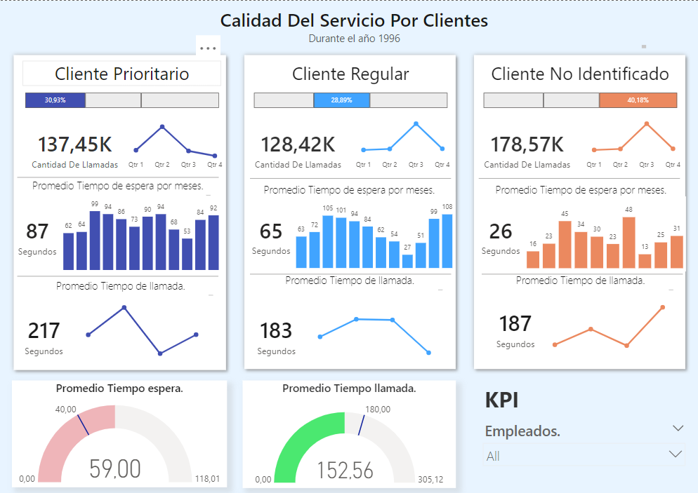
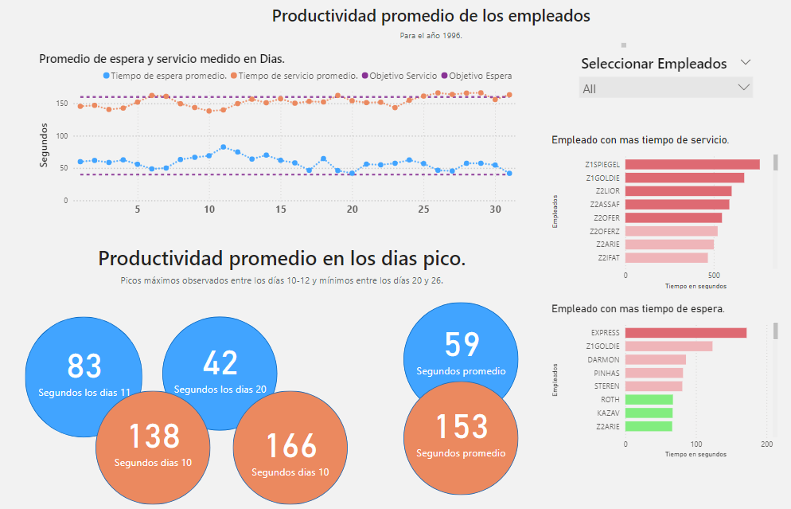

# "Anonymous Bank" Call-Center



## Introducción

En este proyecto, se ha aplicado una limpieza y analisis exploratorio de los datos a travez de python para luego visualizarlo en un Dashboard integral para el Call Center con el objetivo de medir y evaluar los niveles de calidad de servicio, eficiencia y productividad. Este Dashboard está diseñado para ofrecer una visión clara y detallada del desempeño operativo de la empresa, permitiendo a los gestores identificar áreas de mejora y optimizar la experiencia del cliente.

- El archivo  ```Call_Center_1999_DataSet.csv ``` Contiene el archivo CSV de donde se han obtenido los datos.
- El archivo  ```TP Integrador-2.md ``` contiene las preguntas y objetivos del analisis.
- El archivo  ```eda.ipynb ``` contiene la transformacion y el analisis exploratorio de los datos para entender el camino de la empresa.
- El archivo  ```callcenter_pandas.csv ``` contiene el CSV limpio y transformado para utlizar en Power BI.
- El archivo  ```integrador.pbix ``` contiene los dashboards de visualizaciones interactivos para los agentes operativos.
## Descripción de los Datos

El dataset contiene información detallada sobre las llamadas, incluyendo las siguientes columnas:

- ```vru.line```: Código de la unidad de respuesta de voz.
- ```call_id```: Identificador de llamada.
- ```costumer_id```: Identificador de cliente.
- ```Priority```: Prioridad de la llamada. 2 Importante, 0 prospectos.
- ```type```: Tipo de llamada.
Hay 6 tipos diferentes de servicio:
• PS - Actividad Regular
• PE - Actividad Regular en inglés
• IN - Actividad / Consulta por internet
• NE - Actividad por Acciones (stock exchange)
• NW - Cliente potencial (prospecto) solicitando información
• TT – clientes que dejan un mensaje pidiendo al banco que le devuelvan su llamado pero que cuando el sistema automático devuelve el llamado, el agente pasó a estado “ocupado”, dejando al cliente en espera en la cola.
- ```date```: Fecha de la llamada.
- ```vru_entry```: Hora de entrada al bot de llamada.
- ```vru_exit```: Hora de salida al bot de llamada.
- ```vru_time```: Tiempo que duró el bot, calculado por su diferencia en entrada y salida.
- ```q_star```: Hora de entrada a la cola.
- ```q_exit```: Hora de salida de la cola.
- ```q_time```: Duración en la cola de espera.
- ```outcome```: Resultado de la llamada. Atendido, abandonado, fantasma(pocos datos que no se saben que paso).
- ```ser_star```: Hora en que comienza el servicio.
- ```ser_exit```: Hora en que termina el servicio.
- ```ser_time```: Duración del servicio.
- ```server```: Nombre del agente o especificacion si no fue atendido.

## Preguntas Planteadas

### ¿Cuál es el nivel de servicio para los clientes Prioritarios?

El análisis de los tiempos de espera y el tiempo de las llamadas ha proporcionado hallazgos clave sobre el nivel de servicio para los clientes prioritarios en comparación con otros segmentos:

- **Promedio de Tiempo de Espera:** El promedio general de tiempo de espera para todas las llamadas es de 59 segundos. Sin embargo, se observa una variación significativa entre los tipos de clientes:
  - **Clientes No Identificados:** 26 segundos
  - **Clientes Regulares:** 65 segundos
  - **Clientes Prioritarios:** 87 segundos

- **Tiempo Promedio de Llamada:** El promedio total de tiempo de llamada es de 152 segundos. Las variaciones entre los tipos de clientes son las siguientes:
  - **Clientes No Identificados:** 187 segundos
  - **Clientes Regulares:** 183 segundos
  - **Clientes Prioritarios:** 217 segundos
  - 
###¿Qué volumen de llamadas atendemos?

- **Distribución del Volumen de Llamadas:**
  - **Clientes Prioritarios:** 30%
  - **Clientes Regulares:** 29%
  - **Clientes No Identificados:** 40%

### ¿Damos un mejor servicio que a los clientes normales?

- **Desempeño por Cuartos:**
  - En el primer y segundo cuarto del período analizado, el volumen de llamadas prioritarias era mayor en comparación con otros tipos de clientes, con un tiempo de espera promedio de 85 segundos, frente a 80 segundos para clientes regulares y 30 segundos para clientes no identificados.
  - En los últimos dos cuartos, aunque el volumen de llamadas prioritarias disminuyó, el tiempo de espera para estos clientes solo se redujo ligeramente a 85 segundos. En contraste, los clientes regulares y no identificados experimentaron una notable mejora en sus tiempos de espera, con promedios reducidos a 45 segundos.
  - En cuanto al tiempo promedio de llamada, los clientes prioritarios redujeron su tiempo de 225 segundos a 193 segundos en el tercer cuarto. En cambio, los clientes no identificados vieron un aumento en el tiempo de llamada de 167 segundos a 195 segundos en el cuarto cuarto.

Estos hallazgos sugieren que, a pesar de una disminución en el volumen de llamadas prioritarias, el tiempo de espera para estos clientes sigue siendo considerablemente alto en comparación con otros segmentos. Además, aunque hubo una mejora en el tiempo de espera para clientes regulares y no identificados en los últimos cuartos, el tiempo promedio de llamada para clientes prioritarios sigue siendo superior al de los otros segmentos. La reducción en el tiempo de llamada para clientes prioritarios en el tercer cuarto es positiva, pero sigue siendo superior al tiempo de servicio de los demas segmentos, donde entra una controversia si puede ser mejor dedicarle mas tiempo al cliente prioritario o solucionar su llamada mas rapido.


### ¿Cómo es la eficiencia y productividad de nuestros agentes?
- **Eficiencia y Productividad de los Agentes:**
  - **Tiempo de Servicio de los Agentes:** Se ha observado que algunos agentes tienen tiempos de servicio significativamente altos. Por ejemplo, el agente `z1spiegel` tiene un tiempo promedio de servicio de 761 segundos, donde pareciera que los agentes comenzados con  `Z ` superan los 500 segundos de tiempo de servicio. Estos tiempos de servicio elevados pueden indicar una oportunidad para revisar y optimizar capacitación adicional a estos agentes.
  - **Tiempo de Espera Promedio:** El tiempo de espera promedio total está notablemente por encima del objetivo de 40 segundos, alcanzando un pico de 83 segundos los dias entre 10 y 12 de todos los meses. Este tiempo de espera prolongado puede estar afectando la experiencia del cliente y la eficiencia operativa general.

### ¿Cuáles son los cuellos de botella? ¿En qué días?
- **Cuellos de Botella y Análisis por Días:**
  - **Picos Máximos y Mínimos:** 
    - **Días 10 a 12:** Se observan una relacion inversa en el tiempo de espera y el tiempo de servicio. En estos días, el tiempo de servicio alcanza su valor más bajo en comparación con otros días, con un promedio de 138 segundos, mientras que el tiempo de espera es muy alto, superando los 83 segundos. Esta correlación inversa indica que, en días con alta espera, el tiempo de servicio tiende a ser más rápido, pero la alta espera puede estar contribuyendo a la percepción negativa del servicio.
    - **Días 20 a 26:** Durante este período, se registra una mejora en el tiempo de servicio, con un promedio de 143 segundos, por debajo del objetivo de 160 segundos. Sin embargo, el tiempo de espera sigue estando muy por encima del objetivo, alcanzando un promedio de 62 segundos el día 23. La correlación inversa observada sugiere que, cuando el tiempo de servicio mejora, el tiempo de espera promedio tiende a aumentar, lo cual es una tendencia que debe ser abordada.

- **Análisis Adicional:**
  - **Agentes con Alto Tiempo de Espera:** El agente `express` presenta el mayor tiempo promedio de espera, con 171 segundos, lo que está por encima del objetivo. Sin embargo, es importante destacar que el 70% de los agentes están logrando tiempos de espera por debajo del objetivo, lo que indica que hay margen para mejorar en algunos casos específicos.


## Conclusiones

El análisis de los datos de la empresa revela áreas críticas para mejorar la eficiencia operativa y la satisfacción del cliente. Los hallazgos clave se resumen a continuación:

### Análisis de Desempeño

- **Nivel de Servicio:**
  - El tiempo de espera promedio cumple con los objetivos si les quitamos los outliers que manchan el promedio, con algunos superando los 500 segundos, pero al dejarlos en los datos indica que los agentes  `Z` estan muy por encima quintuplicando los valores normales de los demas agentes.
  - Los clientes prioritarios experimentan un tiempo de espera promedio de 87 segundos, considerablemente más alto que los clientes regulares y no identificados. Aunque se ha observado una ligera mejora en los últimos cuartos, los tiempos de espera siguen siendo inaceptables para este grupo de clientes.

- **Volumen de Llamadas y Tiempos de Espera:**
  - Pueden ajustarse los dias de trabajo y horas de los mejores agentes para los dias de picos maximos asi lograr una mejora al cliente.

### Recomendaciones y Nuevos Objetivos

1. **Definición de Nuevos Niveles Objetivos:**
   - **Tiempo de Espera:** Reducir el tiempo de espera promedio a un máximo de 40 segundos. Para los clientes prioritarios, establecer un objetivo específico de 60 segundos, dada la complejidad de sus solicitudes.
   - **Tiempo de Servicio:** Mejorar el tiempo promedio de servicio a menos de 150 segundos para todos los clientes. Implementar un seguimiento más riguroso para los agentes que superan los 500 segundos.

2. **Mejoras Operativas:**
   - **Capacitación y Gestión de Agentes:** Implementar programas de capacitación específicos para agentes con tiempos de servicio elevados. Establecer un sistema de monitoreo y feedback continuo para mejorar el desempeño.
   - **Optimización de Procesos:** Revisar y ajustar los procesos internos para reducir los tiempos de espera y servicio. Considerar la implementación de herramientas tecnológicas para gestionar y priorizar las llamadas de manera más eficiente.
   - **Implementacion de encuestas de satisfaccion** Implementar un software de encuestas luego de cada llamada para medir no solo sus tiempos de espera y servicio si no ademas su calidad de servicio para encontrar patrones en tiempos de servicios tan altos.

3. **Herramienta de Gestión y Toma de Decisiones:**
   - **Alertas y Reportes:** Implementar alertas automáticas para notificar a los managers sobre desviaciones significativas de los objetivos y generar reportes periódicos para evaluar el desempeño y las tendencias.

Estos pasos contribuyen a mejorar la eficiencia operativa, ofrecer un servicio más satisfactorio a los clientes prioritarios y proporcionar a los managers las herramientas necesarias para una toma de decisiones informada y eficaz. Implementar estos cambios no solo mejorará el desempeño de la empresa, sino que también fortalecerá la satisfacción del cliente. 
  
 
